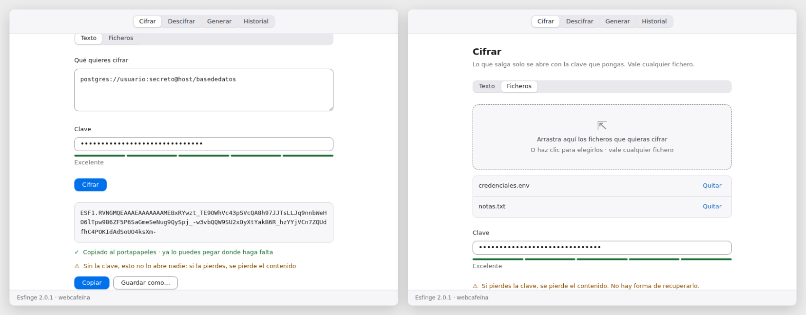
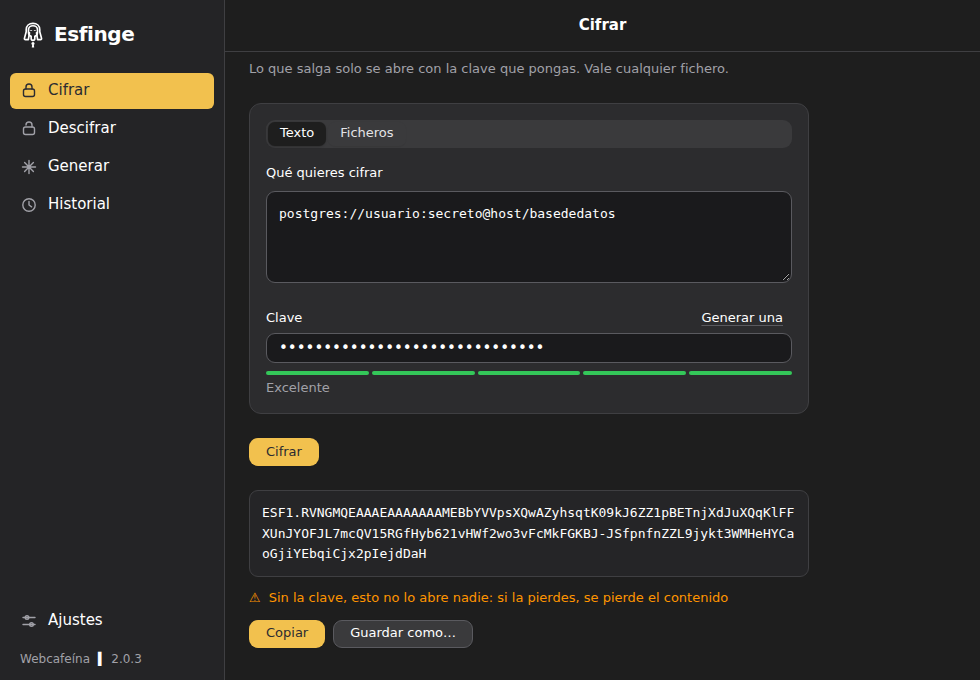

<div align="center">


# Esfinge

**Cifra y descifra contraseñas y ficheros con una clave.**
Sin cuentas y sin servidores: lo que cifras no sale de tu ordenador.

[](https://github.com/webcafeina/esfinge/actions/workflows/compilar.yml)
[](https://github.com/webcafeina/esfinge/releases/latest)
[](LICENSE)





</div>

## Descargar

<!-- descargas:inicio · las escribe herramientas/actualizar-descargas.sh -->

| Sistema | Descarga | Notas |
|---|---|---|
| **macOS** | [Esfinge-2.9.2.dmg](https://github.com/webcafeina/esfinge/releases/download/v2.9.2/Esfinge-2.9.2.dmg) | Universal: Apple Silicon e Intel |
| **Windows** | [Esfinge-2.9.2-windows-instalador.exe](https://github.com/webcafeina/esfinge/releases/download/v2.9.2/Esfinge-2.9.2-windows-instalador.exe) | Asistente de instalación |
| **Linux · Debian y Ubuntu** | [esfinge_2.9.2_amd64.deb](https://github.com/webcafeina/esfinge/releases/download/v2.9.2/esfinge_2.9.2_amd64.deb) | Aplicación y línea de comandos |
| **Linux · cualquiera** | [esfinge-2.9.2-linux-amd64.tar.gz](https://github.com/webcafeina/esfinge/releases/download/v2.9.2/esfinge-2.9.2-linux-amd64.tar.gz) | Los binarios sueltos |
| **Línea de comandos** | [todos los sistemas](https://github.com/webcafeina/esfinge/releases/latest) | Seis objetivos, con sus SHA256 |

Versión **2.9.2**. Las anteriores, en [publicaciones](https://github.com/webcafeina/esfinge/releases).

<!-- descargas:fin -->

> **La primera vez, el sistema avisará de que Esfinge no está firmada.** Es cierto: firmar cuesta
> 99 $ al año y se decidió no hacerlo ([por qué](docs/adr/0012-sin-firmar.md)). En macOS, si el
> aviso no te deja abrirla, ve a **Ajustes del Sistema → Privacidad y seguridad** y pulsa «Abrir de
> todos modos». En Windows, «Más información» → «Ejecutar de todas formas».

## Qué hace

**Cifra un texto** —una contraseña, un token, una cadena de conexión— y devuelve una línea como
esta, que se puede pegar en un correo, en un chat o dentro de una URL sin escapar nada:

```
ESF1.RVNGMQEAAAEAAAAAAAMEW77N6LiWIRQM4fm0l8P6mt8PbFAz4GJC-C0icDTG7h7iJWpBo
```

**Cifra ficheros**, arrastrándolos a la ventana. Varios a la vez, con la misma clave. El original no
se toca.

**Genera contraseñas** en hexadecimal por defecto, que es el único alfabeto que se puede meter en
una cadena de conexión sin que se rompa por un `/` ([por qué](docs/adr/0004-contrasenas-en-hexadecimal.md)).

**Lleva un historial** de qué se cifró y cuándo. Nunca el contenido, ni la clave, ni el texto
cifrado.

**Se actualiza sola**, o casi: avisa cuando hay versión nueva, se descarga el instalador de tu
sistema comprobando que llegó entero, y lo abre. No hay que desinstalar nada. Es lo único que Esfinge
hace fuera de tu ordenador —una consulta al día a GitHub, sin mandar nada— y se apaga en Ajustes
([qué se envía, exactamente](docs/seguridad.md#lo-único-que-sale-de-la-máquina)).

Y trae **línea de comandos** para lo mismo, pensada para tuberías y scripts:

```sh
echo -n 'secreto' | esfinge cifrar --clave-env CLAVE
esfinge cifrar -i credenciales.env -o credenciales.env.esf
esfinge generar --bytes 32
```

## Lo único que hay que tener claro

**Sin la clave no hay forma de recuperar nada.** Esto no es una cuenta con «he olvidado mi
contraseña»: si se pierde la clave, el contenido se ha perdido, y no hay nadie —tampoco
Webcafeína— que pueda abrirlo.

Y manda el resultado y la clave por caminos distintos. Si van en el mismo correo, quien lea ese
correo lo tiene todo.

## Por dentro

XChaCha20-Poly1305 con Argon2id, en un contenedor versionado. Los ficheros van por segmentos, cada
uno con su etiqueta y una marca en el último, que es lo que hace que un fichero cortado por la mitad
se detecte en vez de descifrarse a medias y en silencio.

El código está publicado para poder auditarse: en algo que cifra, eso es parte del argumento.
[Qué protege y qué no](docs/seguridad.md) · [Las decisiones, con su porqué](docs/decisiones.md)

## Desarrollo

Go 1.27, Node 22 y pnpm 11.

```sh
make comprobar   # vet, tests de Go y tipos de la interfaz
make contraste   # mide el contraste de los dos temas
make e2e         # mueve la interfaz de verdad contra el Go de verdad
make ayuda       # el resto
```

La documentación de trabajo está en **[docs/](docs/)**: dónde está el proyecto, qué viene después,
qué se decidió y por qué, y qué está a medias.

---

<div align="center">

▍ **webcafeína**

</div>
